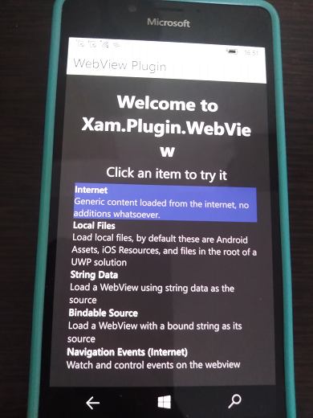

# ProjectSpartanX

Cross-platform WebBrowser prototype compatible with Windows10Mobile (?)
Min win os build : 15063

Based on: Xamarin Forms tech.

## Screenshots

## 2 words about "workbench"
-Used IDE: Visual Studio 2022 Preview
-Used components/modules/"plugins": Xam.Plugin.WebView 
-Platforms: UWP, Android, iOS

## Referencies
Some Xamarin Forum themes (about Hybrid WebView)

## ..
AS IS. No support! RnD only.

-- [m][e] 2022